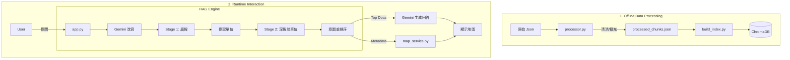

# 台大行政小助手：程式架構與流程解析

整套系統分為 **資料處理 (前置作業)** 與 **即時運作 (網頁互動)** 兩大部分。

## 1. 資料前處理 (Data Preprocessing) -- *Offline Phase*
這是在啟動網頁前必須先完成的步驟，負責將原始資料轉化為可檢索的知識庫。

- **核心腳本**: `processor.py`
- **主要流程**:
    1.  **讀取資料**: 掃描 `data/` 目錄下所有爬蟲抓取的 JSON 檔。
    2.  **建立位置圖譜**: 掃描所有資料，預先建立一張「單位名稱 -> 地點 (建築/樓層/房號)」的對照表。
    3.  **文本擴充**: 將位置資訊「注射」回每個單位的相關文檔中（例：看到「註冊組」自動補上「位於行政大樓...」），確保檢索時能關聯到地點。
    4.  **建立 Location Chunks**: 額外產生專門的 `location` 類型文檔，提升「在哪裡」這類問題的命中率。
    5.  **輸出**: 產生 `processed_chunks.json`。
    6.  **向量化**: 透過 `build_index.py` 呼叫 Embedding 模型，將清洗後的文字轉為向量，存入 `ChromaDB` 資料庫。

## 2. 網頁應用程式 (Streamlit App) -- *Runtime Phase*
這是使用者實際操作的介面。

- **核心腳本**: `app.py`, `rag_engine.py`, `map_service.py`
- **互動流程**:

### A. 啟動與初始化
1.  **App 啟動 (`app.py`)**: 初始化 Streamlit 介面。
2.  **引擎載入**:
    -   `EnhancedRAGEngine` (`rag_engine.py`): 負責檢索邏輯，連線 ChromaDB。
    -   `MapService` (`map_service.py`): 預載台大建築物座標資料。

### B. 使用者提問處理 (User Query Loop)
當你輸入問題（例如：「休學要去哪裡辦？」）時：

#### Step 1: 查詢優化 (Query Rewrite)
-   系統將你的問題結合「對話歷史」傳給 Gemini，改寫成完整查詢句（補全代名詞）。
-   自動附加篩選條件（如：醫學院、學士班）。

#### Step 2: 雙階段檢索 (Two-Stage Retrieval) -- *系統大腦*
這是 `EnhancedRAGEngine` 的核心邏輯：
1.  **Stage 1 (廣搜)**: 先從大量資料中找出最相關的 5 筆。
2.  **單位提取**: 分析這 5 筆資料指向哪些行政單位（例如：「註冊組」）。
3.  **Stage 2 (深搜)**: **強制鎖定**這些單位，再次去資料庫把該單位的「位置」、「電話」、「規章」全部撈出來。
4.  **意圖重排序**: 判斷你是問「位置」還是「流程」，將對應類型的資料排在最前面。

#### Step 3: AI 回答生成 (Generation)
-   將整理好的參考資料（含地點資訊）餵給 Gemini Pro。
-   Gemini 生成親切、專業的回答。

#### Step 4: 自動地圖生成 (Dynamic Map)
-   `app.py` 檢查檢索到的資料中是否包含建築物資訊。
-   呼叫 `map_service`:
    -   提取建築物名稱（如「行政大樓」）。
    -   取得座標。
    -   繪製互動式地圖 (Folium)。
-   地圖直接顯示在回答下方。

---

## 核心流程圖

